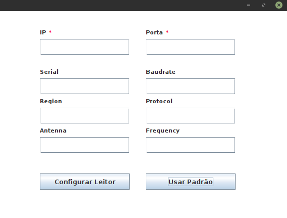
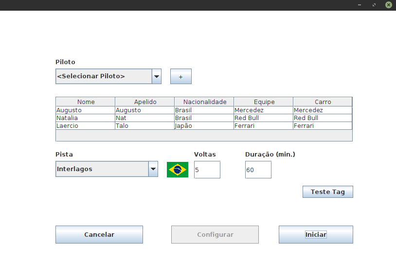

# Sistema de Autorama

<p align="center">Projeto desenvolvido para o MI de Redes do curso de Engenharia da Computação da UEFS no semestre 2020.1</p>

<!--ts-->
   * [Sobre](#sobre)
   * [Funcionalidade](#funcionalidade)
   * [Como Rodar o Servidor](#como-rodar-o-servidor)
      * [Pré Requisitos do Servidor](#pré-requisitos-do-servidor)
      * [Rodando o Servidor](#rodando-o-servidor)
   * [Como Rodar o Cliente](#como-rodar-o-cliente)
      * [Pré Requisitos do Servidor](#pré-requisitos-do-cliente)
      * [Rodando o Cliente](#rodando-o-cliente)
   * [Tecnologias](#tecnologias-🛠)
<!--te-->

## Sobre

O projeto consiste em um sistema de autorama de carros usando um Raspberry Pi e um módulo de leitura RFID com suporte a TAGs, sendo separado por um servidos em python (rodando no raspberry) e um cliente em java (rodando em qualquer máquina).

 

## Funcionalidade
- Cadastro de pilotos, carros, equipes e pistas
- Configuração e gerenciamento de corrida:
   - Etapa de qualificação
   - Corrida

## Como Rodar o Servidor
### Pré Requisitos do Servidor
Antes de começar, você precisa ter instalado em seu rapsberry o [python 3.6+](https://www.python.org/downloads/) e o [ThingMagic Mercury API](https://github.com/gotthardp/python-mercuryapi) para leitura dos dados do módulo RFID.

### Rodando o Servidor

```bash
# Copie o diretório server para o raspberry
# Acesse a pasta do projeto no terminal
$ cd server

# Execute o comando para rodar o projeto
$ python3 server.py

# Por padrão o projeto será iniciado na porta 5022, 
# caso a porta já esteja em uso ele solicitará outra porta.
```
Com o servidor rodando os clientes poderão conectar e chamar as rotas seguindo o seguinte padrão:
<blockquote>MÉTODO ROTA \quebra_de_linha BODY_EM_JSON</blockquote>
Exemplo: 
<blockquote>POST /rfid/config\n{"serial":"tmr:///dev/ttyUSB0", "baudrate":"230400", "region":"NA2", "protocol":"GEN2", "antenna":"1", "frequency":"1800"}</blockquote>
A cada chamada o servidor retorna uma mensagem seguindo o seguinte padrão:
<blockquote>STATUS \quebra_de_linha RESPONSE_EM_JSON !</blockquote>
Exemplo:
<blockquote>OK \n {"tags":[b'E2000017221101241890547C', b'E20000172211012518905484', b'E20000172211011718905474']}!</blockquote>

## Como Rodar o Cliente
### Pré Requisitos do Cliente
Antes de começar, você precisa ter instalado em sua máquina o [java 8+](https://www.java.com/download/ie_manual.jsp) e o [NetBeans](https://netbeans.apache.org/download/index.html) para buildar e executar o cliente.

### Rodando o Cliente

Abra o projeto pelo netbeans. Na primeira tela o botão "Utilizar configuração padrão" já está implementado para facilitar a configuração com a raspberry. 
Após avançar na etapa de configuração, você será apresentado à tela de cadastro onde deverá seguir a seguinte ordem:
- Cadastro de Carros (lembrando que não deve-se repetir o nome da marca);
- Cadastro de Pilotos (lembrando de associar a um carro cadastrado);
- Cadastro de Equipe;
- Cadastro de Pista;
- Qualificação;

Apenas carros e pilotos que fazem parte de uma equipe podem participar da corrida.

## Tecnologias 🛠 

As seguintes ferramentas foram usadas na construção do projeto:
- [Python](https://www.python.org/)
   - [Thingmagic Mercury API](https://www.jadaktech.com/products/thingmagic-rfid/thingmagic-mercury-api/)
- [Java](https://www.java.com/)